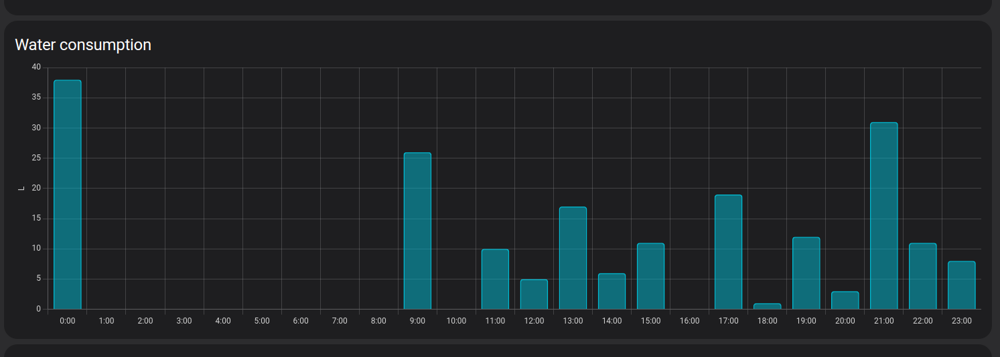

# Thames Water Integration

# Home Assistant Integration for Thames Water Consumption Data

This Home Assistant integration retrieves water consumption data from Thames Water using their API. It allows you to monitor your water usage directly from your Home Assistant setup without needing additional devices.

You need a **Thames Water Smart Meter**. The water consumption data provided by this integration is delayed by approximately three days or more. This delay is a characteristic of the Thames Water data system and cannot be altered in this integration.

The integration uses Selenium to log in to the Thames Water website, as it needs to obtain the browser cookies to make the API call. I use the Selenium Addon in Home Assistant.

With these cookies, it then calls the `getSmartWaterMeterConsumptions` API to retrieve the usage data.

The integration was created recently, so it may contain bugs. Proceed with caution!

On the first run it may take more than a minute to become ready.

## Installation

### Installation through HACS

1. Install the custom component using the Home Assistant Community Store (HACS) by adding the Custom Repository:
https://github.com/ale770/ha-thames-water
2. In the HACS panel, select Thames Water from the repository list and select the DOWNLOAD button.
3. Restart HA
4. Go to Settings > Devices & Services > Add Integration and select Thames Water.

### Manual installation

Copy the `custom_components/thames_water/` directory and all of its files to your `config/custom_components/` directory.

## Configuration

Once installed, restart Home Assistant:

Then, add the integration:

  
Manually add the Integration

  Visit the <i>Integrations</i> section in Home Assistant and click the <i>Add</i> button in the bottom right corner. Search for <code>Thames Water</code> and input your details. <b>You may need to clear your browser cache before the integration appears in the list.</b>

## Energy Management

The water statistics can be integrated into HA [Home Energy Management](https://www.home-assistant.io/docs/energy/) using **thames_water:thameswater_consumption**.

**thames_water:thameswater_cost** can be used to track costs.
The cost per litre can be configured in the device configuration page.
Changing this value will only affect new readings. If you want to update past readings you'll need to remove the integration, delete the statistics and add the integration again.

It will attempt to fetch the latest data at 00:00 and 12:00 every day.

